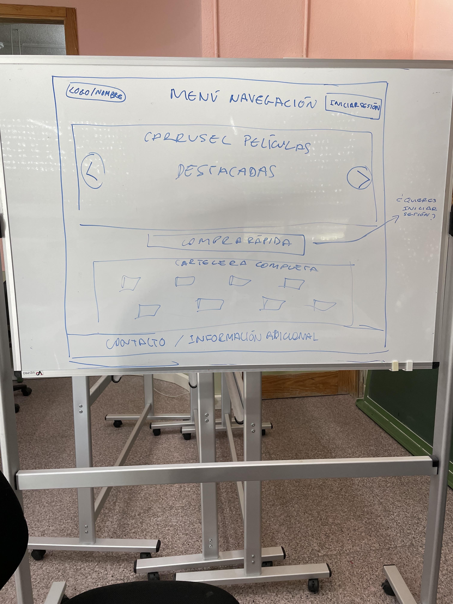
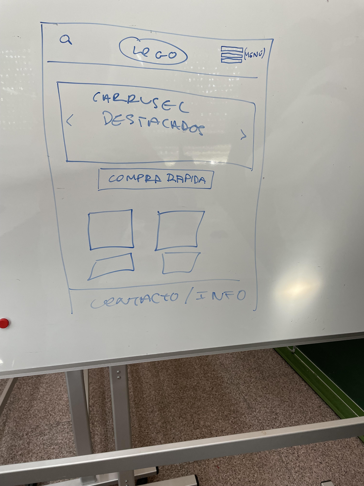
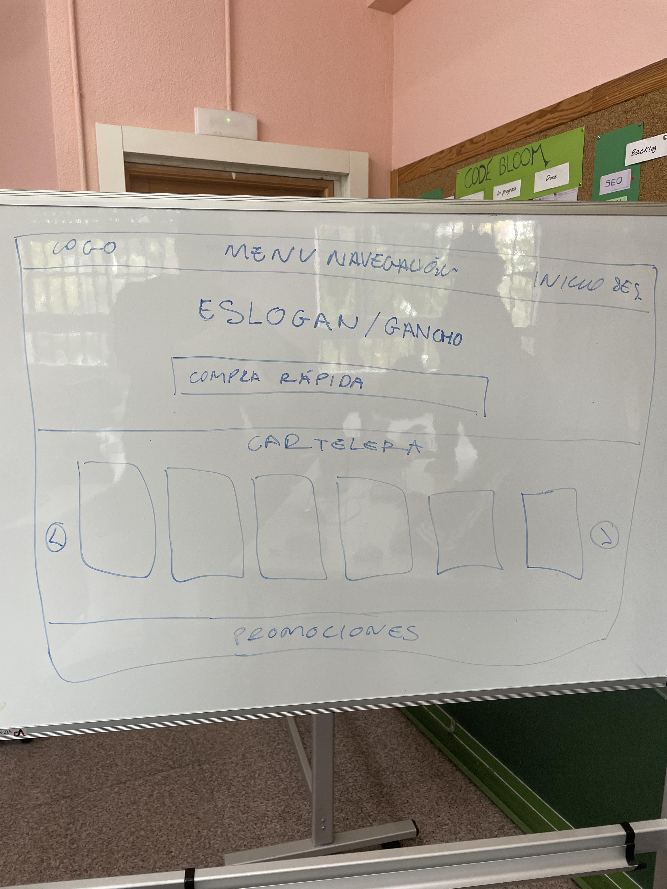
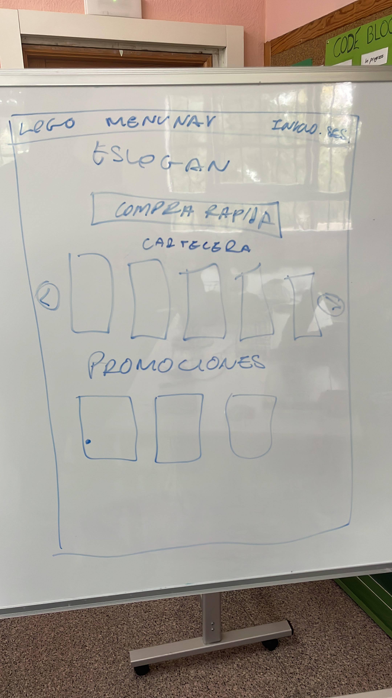
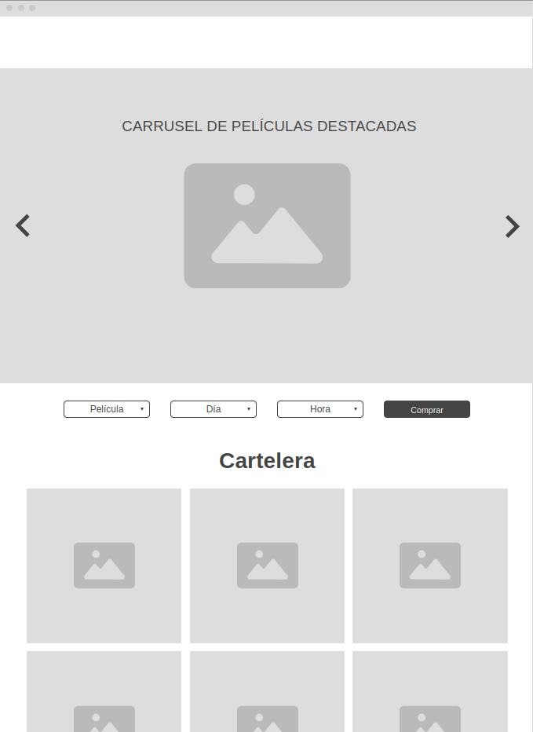
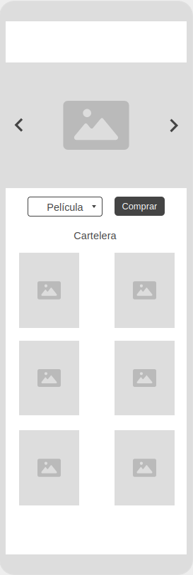
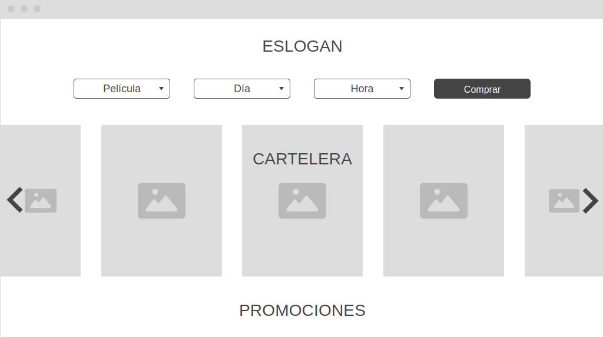
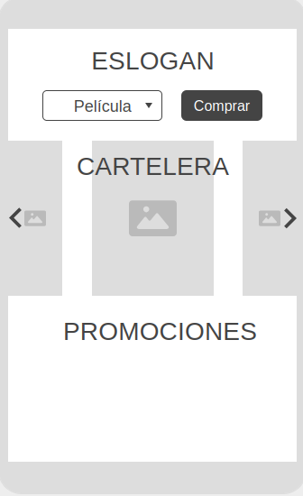

## 1. Análisis de la competencia

### Tendencias

Las tendencias de diseño web general más observadas son las siguientes:  
- Minimalismo y espacios en blanco.
- Tipografía grande.
- Opción para modo oscuro.
- Animaciones e interactividad.
- Navegación intuitiva.
- Contenido visual atractivo.
- Recomendaciones y enlaces con contenido relacionado.
- Carrito para compras.
- Promociones y códigos de descuento.
- Opción de iniciar sesión.
- Mucha presencia de redes sociales.
- Diseños adaptados a móviles y *tablets*.

### Competencia dentro del sector

Los diseños de los sitios web dedicados a los cines suelen presentar estas características:  
- Página de inicio dedicada a la cartelera.
- Uso predominante del color blanco, contrastado con algunas secciones de color oscuro.
- Carteles de películas muy llamativos para fomentar la venta de entradas.
- Opción de comprar entradas y elegir las butacas.
- En cines con varias sucursales, se permite acceder a todas ellas o seleccionar la más cercana automáticamente.
- Se destacan las películas más taquilleras y se ofrecen *rankings* semanales.
- Se enfatizan los distintos tipos de servicio ofrecidos (*luxury*, prémium...).
- Navegación por categorías (géneros, recomendaciones, lo más visto...).

## 2. Análisis de elementos de diseño

### Elementos visuales - Color

Aunque quizás cabría esperar que el color más predominante en los sitios web de los cines sería el negro (para simular el ambiente de una sala de cine), en realidad el más habitual es el blanco (combinado, eso sí, con algunos elementos oscuros). Esto seguramente busca transmitir formalidad y elegancia.  

### Elementos conceptuales - Plano

La mayoría de los sitios web de la competencia siguen la tendencia actual de hacer diseños sin volumen. A diferencia de lo que ocurría, en general, hace unos años, cuando los botones y los distintos elementos destacaban su relieve, los diseños suelen ser fundamentalmente planos.  

### Elementos prácticos - Representación

A pesar de las múltiples diferencias entre unos y otros, en última instancia todos los diseños buscan hacer una representación digital, tanto estética como funcionalmente, del local físico de un cine.  

### Elementos de redacción - Espacio

Los diseños reflejan la tendencia moderna de utilizar grandes espacios en blanco. Y aunque algunos sitios comprimen el uso de las imágenes de la cartelera, presumiblemente para poder mostrar la mayor cantidad posible de películas en un único vistazo, otros no lo hacen. Esto implica que, a menudo, es necesario desplazarse mucho por la página para poder abarcarlo todo.  

## 3. Prototipos de *landing page*

Para diseñar nuestra *landing page*, primero creamos un par de bocetos a mano y luego los convertimos en prototipos digitales usando Wireframe. Finalmente, nos decantamos por la segunda opción, ya que nos parece más innovadora en comparación con los sitios web de la competencia.  

### Primer boceto
#### Escritorio

#### Móvil

### Segundo boceto
#### Escritorio

#### Móvil

### Primer prototipo 
#### Escritorio

#### Móvil

### Segundo prototipo
#### Escritorio

#### Móvil
  

## 4. Paleta de colores

La elección de los colores #0F0233 (un azul oscuro profundo), #FFFFFF (blanco) y #FFC8C8 (un rosa suave) para una web de cine es una combinación interesante que puede funcionar muy bien en este contexto por varias razones:

**1. Profundidad y Dramaticidad (#0F0233):** Este azul oscuro casi púrpura crea una atmósfera de profundidad y misterio que se asocia fácilmente con la experiencia del cine. Este color evoca la sensación de una sala de cine a oscuras, justo antes de que empiece la película, lo que puede ayudar a los usuarios a entrar en el "mood" del cine desde el primer momento que visitan el sitio web. Además, los tonos oscuros funcionan bien en pantallas, ya que ayudan a reducir la fatiga visual, especialmente en entornos con poca luz, y ponen en primer plano el contenido.

**2. Claridad y Legibilidad (#FFFFFF):**  El blanco es un color neutral y claro que complementa al azul oscuro al proporcionar un contraste fuerte. Este color es esencial para garantizar que los textos y otros elementos interactivos sean fácilmente visibles y legibles, especialmente si se colocan sobre el fondo oscuro. También aporta claridad y simplicidad al diseño, ayudando a que la navegación sea intuitiva y que el contenido de la página sea el foco principal.

**3. Calidez y Emoción (#FFC8C8):** El rosa claro añade un toque de calidez y cercanía a la paleta, suavizando la atmósfera dramática del azul oscuro. Este color puede evocar emociones más ligeras y amistosas, ayudando a equilibrar el diseño y haciéndolo más atractivo y acogedor para una audiencia amplia. Además, el rosa claro es un color que puede asociarse a momentos emotivos, una parte importante de la experiencia cinematográfica. En términos visuales, ayuda a guiar la atención del usuario en elementos específicos, como botones de llamada a la acción o secciones destacadas de la web.

**En Conjunto**

Esta paleta no solo proporciona un equilibrio visual entre dramatismo, claridad y emoción, sino que también ayuda a evocar una experiencia cinematográfica al usuario. Los tres colores permiten que el diseño sea tanto envolvente como funcional, garantizando que los elementos clave de la web destaquen de forma adecuada. En conjunto, esta elección de colores crea una atmósfera atractiva y envolvente, haciendo que el visitante asocie inmediatamente la experiencia del sitio web con la del cine.

